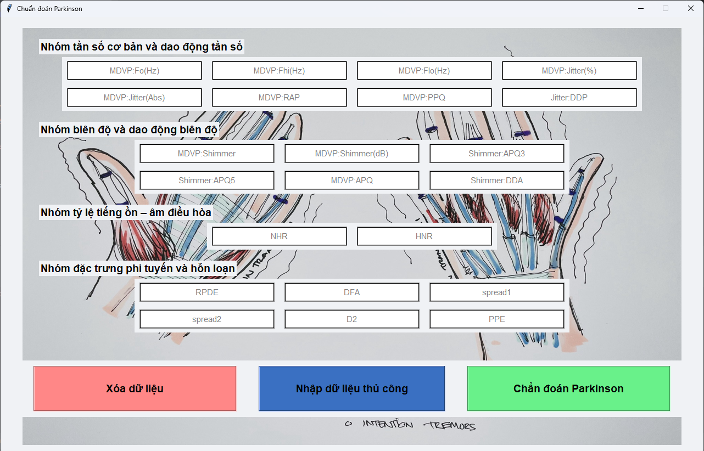
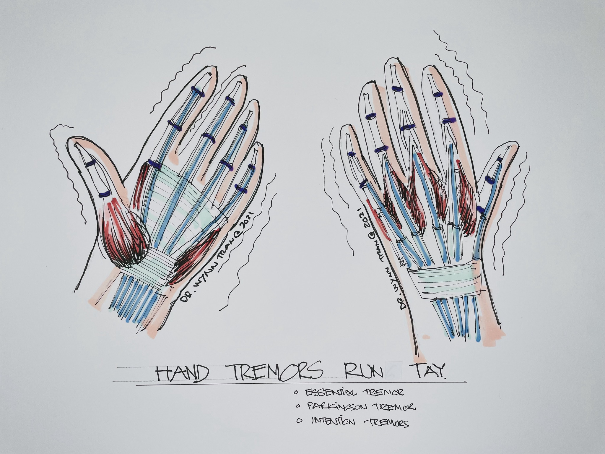
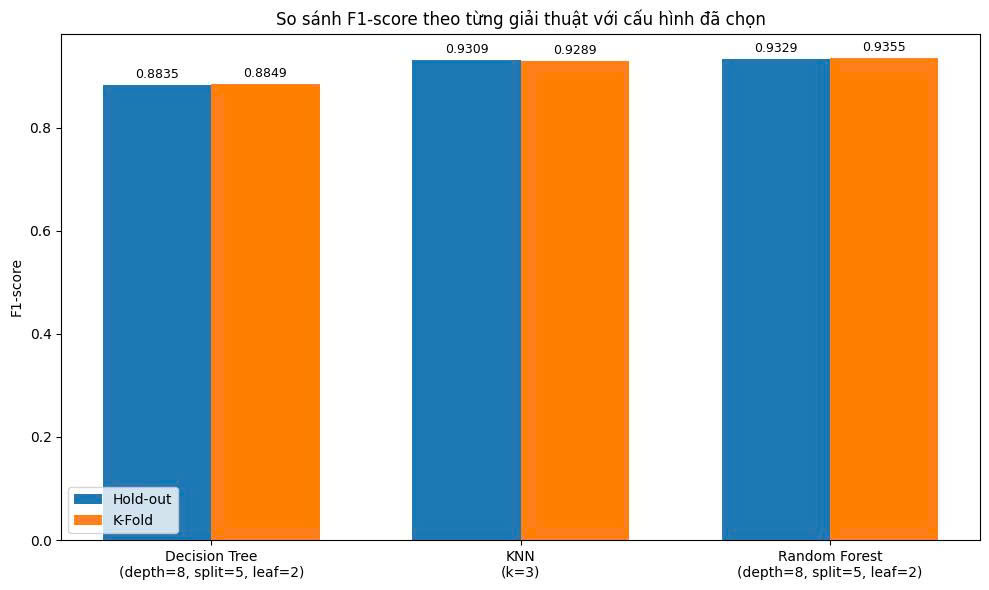

# Nhận biết bệnh nhân Parkinson thông qua các đặc trưng giọng nói với giao diện Tkinter
Đây là một dự án máy học ứng dụng nhằm nhận biết bệnh nhân Parkinson dựa trên các đặc trưng trong giọng nói có triển khai giao diện GUI với tkinter.



---

## Tổng quan

Trong lĩnh vực y tế, việc tận dụng dữ liệu sinh học như tín hiệu giọng nói đang dần trở thành một hướng đi nhiều tiềm năng, đặc biệt khi kết hợp với các kỹ thuật học máy hiện đại. Một trong những ứng dụng tiêu biểu là hỗ trợ phân tích các biểu hiện liên quan đến bệnh lý thần kinh.

Parkinson là một dạng rối loạn thoái hóa thần kinh ảnh hưởng rõ rệt đến khả năng vận động và phát âm của người bệnh. Những thay đổi trong giọng nói dù nhỏ cũng có thể phản ánh mức độ rối loạn vận động thanh quản, từ đó trở thành nguồn dữ liệu quan trọng phục vụ các bài toán phân loại.

Trong nghiên cứu này, chúng tôi tiến hành xây dựng mô hình học máy nhằm phân biệt giữa người mắc bệnh Parkinson và người không mắc, dựa trên các đặc trưng âm học được trích xuất từ tín hiệu giọng nói. Mô hình được huấn luyện nhằm học các đặc điểm nổi bật của tín hiệu, hướng tới khả năng phân loại chính xác qua phân tích giọng nói.



## Cấu trúc thư mục
```
├── LICENSE
├── README.md
├── app.spec
├── config
│   └── train_config.yml
├── create_config.py
├── data
│   ├── processed
│   │   ├── X_test.csv
│   │   ├── X_train.csv
│   │   ├── y_test.csv
│   │   └── y_train.csv
│   └── raw
│       ├── data_description.ipynb
│       ├── parkinsons.data
│       └── parkinsons.names
├── deployment
│   ├── app.py
│   └── rforest_model.pkl
├── experiments
│   ├── dtree
│   │   ├── dtree_hold_out.ipynb
│   │   └── dtree_kfold.ipynb
│   ├── knn
│   │   ├── knn_hold_out.ipynb
│   │   └── knn_kfold.ipynb
│   └── rforest
│       ├── rforest_hold_out.ipynb
│       └── rforest_kfold.ipynb
├── imgs
│   ├── background.png
│   └── f1_score_comparison.png
├── requirements.txt
├── src
│   ├── data
│   │   ├── data_loader.py
│   │   └── preprocess.py
│   ├── models
│   │   ├── dtree.py
│   │   ├── knn.py
│   │   └── rforest.py
│   └── utils
│       └── path_utils.py
└── train
    └── train_model.py
```
---

## Bộ dữ liệu

- Bộ dữ liệu: [Parkinson's Dataset](https://archive.ics.uci.edu/ml/datasets/parkinsons) từ UCI Machine Learning Repository
- Số mẫu: 195 dòng, 22 đặc trưng (không bao gồm "name" và "status")
- Nhãn mục tiêu: status (1 = Mắc Parkinson, 0 = Khỏe mạnh)

---

## Tính năng chính

- Tải và tiền xử lý dữ liệu giọng nói
- Huấn luyện nhiều mô hình học máy (KNN, Cây quyết định, Rừng ngẫu nhiên)
- Đánh giá mô hình bằng k-fold và hold-out
- Xuất mô hình dưới dạng `.pkl` để triển khai
- Xây dựng giao diện GUI tương tác bằng Tkinter để dự đoán

---

## Công nghệ sử dụng

- Python 3.11.9
- Scikit-learn
- Pandas, Numpy
- Seaborn, Matplotlib
- Tkinter (GUI)
- PyInstaller (Deployment)
- Jupyter Notebook (Experiment)

---

## Cài đặt

### 1. Cài đặt Python

- Tải Python **3.11.9** từ [python.org](https://www.python.org/downloads/release/python-3119/)
- Trong quá trình cài đặt tích chọn **"Add Python to PATH"**

### 2. Tạo môi trường ảo (venv)

- Tạo môi trường ảo:
  - **Windows**: `python -m venv .venv`
  - **macOS/Linux**: `python3 -m venv .venv`

- Kích hoạt môi trường:
  - **Windows**: `.venv\Scripts\activate`
  - **macOS/Linux**: `source .venv/bin/activate`

### 3. Cài thư viện cần thiết

- Dành cho **người dùng chạy ứng dụng (GUI, mô hình)** bằng lệnh `pip install -r requirements.txt`

- Dành cho **lập trình viên hoặc cần chạy notebook** bằng lệnh `pip install -r dev-requirements.txt`

> **Ghi chú**:  
> - `dev-requirements.txt` bao gồm toàn bộ thư viện trong `requirements.txt` và bổ sung thêm các công cụ phát triển như Jupyter, Matplotlib, kiểm thử,...
> - Tất cả các notebook thử nghiệm mô hình được lưu tại thư mục `experiments`

---

## Thử nghiệm mô hình
- Đã thử nghiệm các mô hình: Decision Tree, KNN, Random Forest
- Các mô hình được đánh giá theo F1-score với K-Fold và Hold-out
- Biểu đồ minh họa cho thấy Random Forest đạt hiệu suất cao nhất với cấu hình mà chúng tôi cho là tốt nhất



**Chọn mô hình tốt nhất là Rừng ngẫu nhiên để triển khai thực tế cùng với cấu hình đã chọn**

---

## Cấu hình

Việc huấn luyện mô hình được điều khiển thông qua file `config/train_config.yml`

```yaml
model: "random_forest"
data_paths:
  X_train_path: data/processed/X_train.csv
  save_model_path: deployment/rforest_model.pkl
  y_train_path: data/processed/y_train.csv
model_params:
  class_weight: balanced
  criterion: gini
  max_depth: 8
  max_features: sqrt
  min_samples_leaf: 2
  min_samples_split: 5
  n_estimators: 300
  n_jobs: -1
  random_state: 42
```

---

## Chạy mô hình

### 1. Huấn luyện mô hình

Chạy script huấn luyện bằng lệnh `python train/train_model.py`

- Sử dụng cấu hình từ `config/train_config.yml`
- Dữ liệu huấn luyện được nạp từ:
  - `data/processed/X_train.csv`
  - `data/processed/y_train.csv`
- Mô hình Random Forest được huấn luyện và lưu tại `deployment/rforest_model.pkl`

---

## Triển khai

Sau khi huấn luyện mô hình, bạn có 2 lựa chọn triển khai:

### Lựa chọn 1. Chạy trực tiếp bằng Python

- Chạy `deployment/app.py` để mở giao diện GUI viết bằng Tkinter
- Ứng dụng sẽ tải mô hình `.pkl` và cho phép dự đoán từ dữ liệu nhập tay

### Lựa chọn 2. Tạo file `.exe` với PyInstaller (đã có sẵn `app.spec`)

- Để tạo file `.exe`, chỉ cần chạy lệnh `pyinstaller app.spec`
- File thực thi sẽ được tạo tại `dist/app.exe`
- Có thể chạy trên máy khác mà không cần Python hoặc môi trường ảo.
- `pip install pyinstaller` nếu bạn chưa cài `pyinstaller`

---

## Giấy phép

Dự án này được phát hành theo giấy phép MIT. Xem file [LICENSE](LICENSE) để biết thêm chi tiết

---

## Nhóm thực hiện

- Nguyễn Minh Kiệt – Xử lý dữ liệu & mô hình
- Nguyễn Tiến Phát – Thiết kế giao diện GUI
- Nguyễn Hải Đăng – Đóng gói & tài liệu
- Email liên hệ: kietlearntocode@gmail.com

---

##  Đóng góp

- Mọi đóng góp, phản hồi hoặc câu hỏi xin gửi về: kietlearntocode@gmail.com. Chúng tôi hoan nghênh mọi đóng góp!
- Nếu bạn muốn cải tiến dự án:
  - Hãy tạo pull request (PR)
  - Mở issue để báo lỗi hoặc đề xuất tính năng mới
